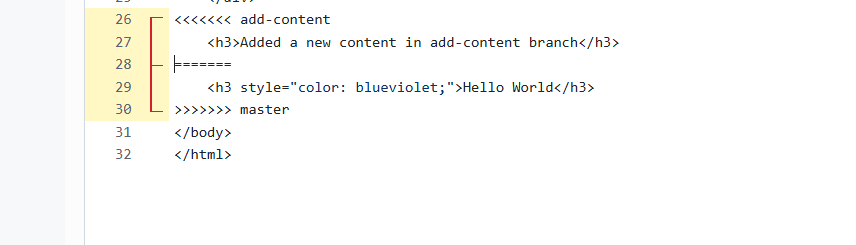
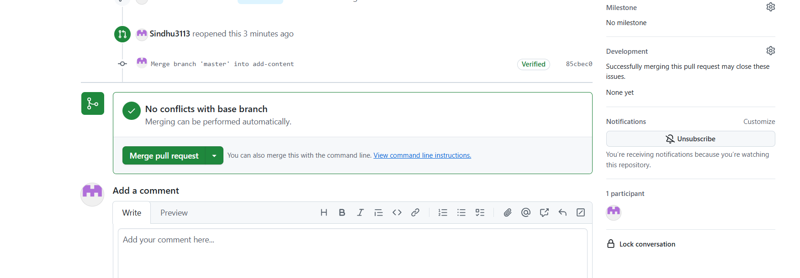
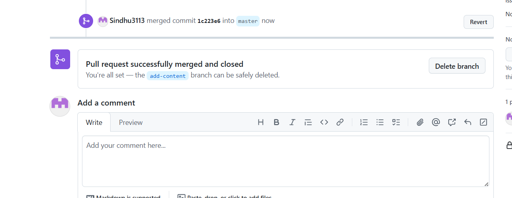

## GitHub repository link with merged branches ##

## Screenshots of merge conflict and resolution process ##

The above img shows the merge conflict beacuse both the branches (add-content branch and master branch) make changes to the same lines in the same file(index.html), by which git cannot determine which change to keep, so git shows a merge conflict.

I have resolved the merge conflict manually in GitHub by keeping the both changes and then committing the result.

The merge conflict has resolved successfully 

## How merge conflict is resolved ##
The merge conflict thst occured because add-content branch and master branch make changes to the same line in the same file i.e index.html,  by which git cannot determine which change to keep, so git shows a merge conflict. 
I resolved the conflict manually in GitHub by accepting both the changes, and then committed the changes(by clicking on commit changes) and after commiting the changes it displayed a UI to Merge Pull Requests(i.e there is no conflicts you can merge the branches).
After clicking on the merge Pull request both the branches got merged successfully.